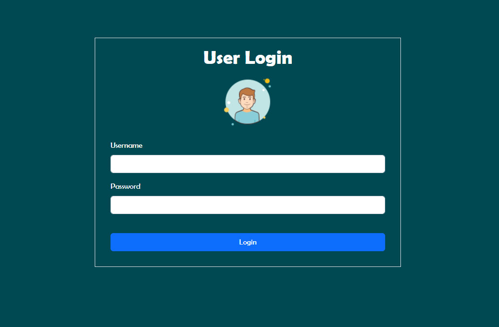
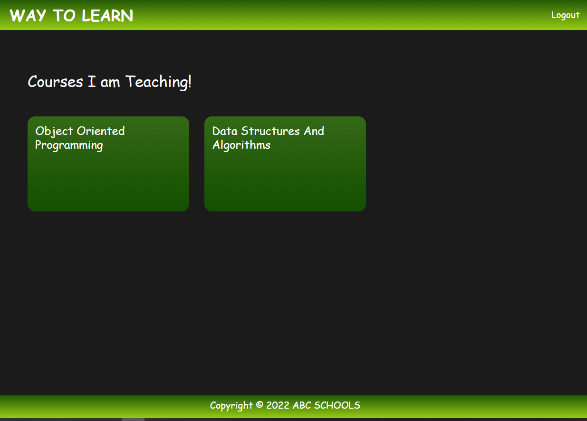

# Lms System MVC

This is a learning management project made in asp.net mvc 5 and sql server database.

## Technology Used

- **Visual Studio 2022**
- **Sql Server Management Studio 2018**
- **Asp.net MVC 5**
- **Ado.net**
- **C#**
- **Html**
- **Css**
- **Js/Jquery**
## Major Roles
- Admin
- Teacher
- Student

## Functionalities
- Admin can add, delete, update see teachers.
- Admin can add, delete, update see students.
- Admin can add, delete, update see departments.
- Admin can add, delete, update see programs.
- Admin can add, delete, update see courses.
- Admin can add, delete, update see classes.
- Admin can assign class to Teachers and 
- ============================
- Teachers can see the courses they are teaching
- Teachers can see the students enrolled in that.
- Teachers can edit their profile.
- ============================
-  Students can edit their profile.
- Students can see the courses they are enrolled in.
- Students can register for new courses if eligible.
## Demo
### Er Diagram

### Login Screen

### Admin Home

### Students List

### Create Students

### Create Teacher

### Teachers List

### Courses List

### Courses Creatr

### Classes Page

### Logout 

### Teacher home

### Teacher courses

### Teacher Class time

### Teacher Profile

